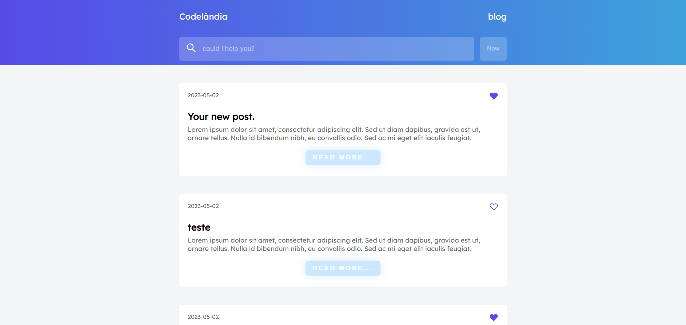

<h1 align="center"> Blog - React Router Version 💻 </h1>

## Briefing 📄

Rebuild of the previously blog I built with pure react, now with react router. Added more features and improvements. Used a few libraries like matchSorter, localforage and sortBy either but nothing worthy of mention.

> [Acessar](https://blog-react-routerv6.netlify.app)

<h2 align="left"> Objetivo 📌 </h2>

- Improve ReactJs skills.

---

<h3 align="center"> Home 📷 </h3>

<h3 align="center"> Tecnologias utilizadas 🤖 </h3>

> 

